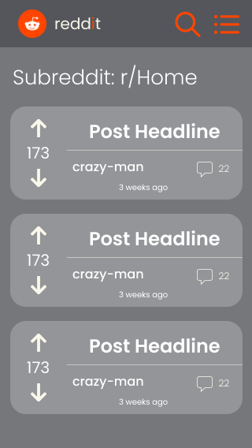
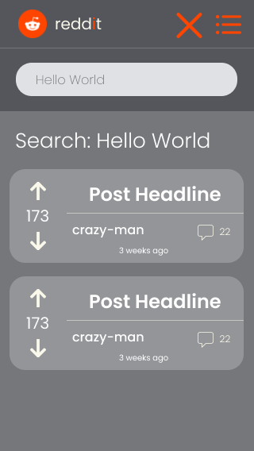
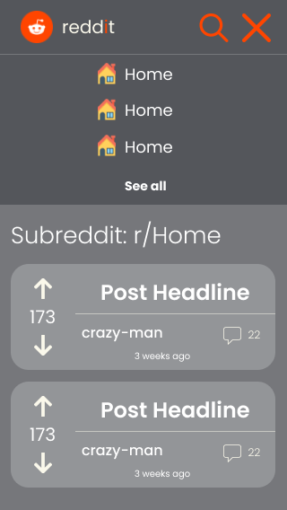
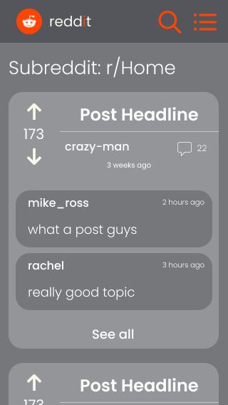
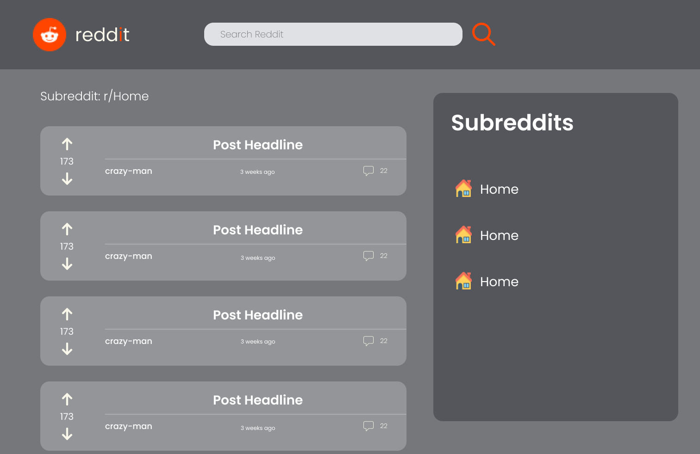
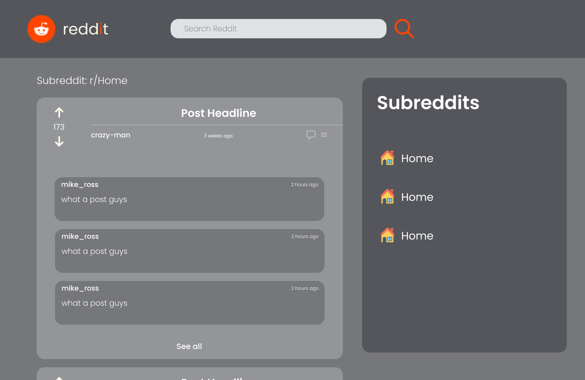

# Reddit Client

#### Mobile version 

#### Desktop version

To see the project on Figma, click [here](https://www.figma.com/file/qD8S0ysXyrCvfZUqpgWpsq/Reddit-Client?node-id=0%3A1).

## Table of contents
- [General info](#general-info)
- [Objective](#objective)
- [Technologies](#technologies)
- [Setup](#setup)

## General info

The app is a Reddic Client when the user can see the posts of each subreddit category and search for specific post in the search bar. The user can also see the top-level comments of each post. The app also has ligh mode and dark mode themes.

### App Component

The app has 9 components:

- The **App** component, which manages the top-level components rendering.

- The **Menu** component, which divides in two, one for mobile and another for desktop, what is the **MenuMobile** and **MenuDesktop** components respectively.

- The **SearchBar** component, which allows the user to put inputs and filter related posts.

- The **Subreddits** component, which allows the user to choose a subreddit whose posts will be shown.

- The **Posts** component, which major functions are to render the **Post** components and to require the posts related to a subreddit or to a search in the Reddit API.

- The **Post** component, which main functions are to render the data related to the post - such as author, data, ups - and to control when the comments will be displayed.

- The **Comments** component, which main functions are to render the **Comment** component and to require the commments.

- The **Comment** Component, which major function is to render the data of a comment

### App State

The app's state consists of the following slices:

- searchTerm
- subreddits
- posts
- comments

All states have been managed following the Redux workflow.

### Tests

The major tests have been composed of integration tests, which focuses on the users interactions with the site.

## Objective

Build a porfifolio project that includes the major front-end technologies, like React and Redux.

## Technologies

- CSS 3
- HTML 5
- JavaScript ES6
- React v.17.0.2
- Redux v.7.2.6
- Jest DOM Testing Library v.5.16.2
- React Testing Library v.12.1.2
- Material UI Library v.5.4.1
- Reddit API
- Github
- Git
- Netlify
- Figma

## Setup

To view the live project, click [here](https://pam-reddit-client.netlify.app/).

